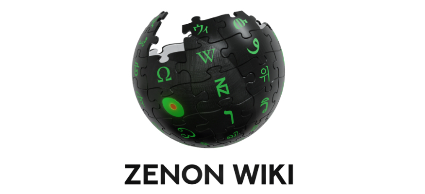

# The ZENON wiki

### Official Zenon Network Resources

​[Website](https://zenon.network)

[Twitter](https://twitter.com/Zenon\_Network?s=20)

[Medium Articles](https://medium.com/@zenon.network)

[Telegram](https://t.me/joinchat/MLyPehLIbJj1nw1XOOOltg)

[Discord](https://discord.com/invite/XDDjECy)

[Github](https://github.com/zenon-network)

​[Bitcointalk](https://bitcointalk.org/index.php?topic=5279643.msg55303681#msg55303681)​

​[Youtube](https://www.youtube.com/channel/UCDb8ZtqBt6l5l4HugCnJwhQ)​

​[Legacy explorer](https://explore.zenon.network)​

​[Testnet explorer](https://explorer.znn.space)​

#### **Zenon Network Guides**

[Node & Pillar building guides](https://github.com/zenon-network/znn-bundle)

[ZENON Tech WIKI](https://wiki.zenon.network/#!index.md)

### Community Resources

_Note: These resources are provided by the community and are not thoroughly vetted by zenon.wiki. Information may be inaccurate, speculative, or out of date._

#### Community Discord

[Zenon Community](https://discord.gg/CK8RpWKD)

#### **Community Telegrams**

​[english](https://t.me/Zenon\_Community)​ ​[français](https://t.me/ZenonFR)​ ​[русский](https://t.me/Zenonnetwork\_Ru)​ ​[nederlands](https://t.me/ZenonNL)​ ​[indonesian](https://t.me/zenonnetwork\_ind)​ [español](https://t.me/Zenon\_Spanish\_Community) [العربية](https://t.me/zenon\_arabic\_community)

#### **Community Articles**

​[Crypto Academy - Lets Explore Zenon Network](https://knowledgeiskey2017.medium.com/lets-explore-zenon-network-cf46d6a8d1ee)​

​[Shazz - Fundamental Analysis of Zenon.Network, based on Charlie Munger's Investment Principles](https://shazzamazzash.medium.com/fundamental-analysis-of-zenon-network-based-on-charlie-mungers-investment-principles-9097db0fa1bd)​

​[Yen Howell - 10 FAQ Investment Questions on Zenon](https://yenhowell.medium.com/zenon-101-10-frequently-asked-questions-when-investing-in-zenon-b7eb0cd1a7de)​

​[Hackernoon - How to not fracture a Layer 1 chain](https://hackernoon.com/how-not-to-fracture-a-layer-1-chain-qgi530g3)​

​[Shazz - Zenon Network - An Apes Guide to the Galaxy](https://shazzamazzash.medium.com/zenon-network-an-apes-guide-to-the-galaxy-7aad7dacdfef)​

​[Georgez Georgez - An Aliens Guide to Lightning and Beyond](https://medium.com/@georgezgeorgez/a-message-to-humans-an-aliens-guide-to-lightning-network-watchtower-limitations-and-beyond-96138967fa9b)​

​[Shaimo - The Zenon Enigma](https://medium.com/@shaimo/the-zenon-enigma-782f8b293bd6)​

#### **Community Guides**

​[Setup Guide - Windows local node](https://frankthezalien.medium.com/how-to-create-a-node-and-connect-to-syrius-a5ad26d8a9b9) by Frank The ZAlien

[Setup Guide - Windows local node ](https://shazzamazzash.medium.com/an-apes-guide-to-run-a-full-node-for-zenon-on-windows-10-910adc2cf8ea)by Shazz

​[Setup Guide - Mac OSX local node](https://pastebin.com/tfgN4d79) by Rex

[​Setup Guide - Mac OSX local node](https://twitter.com/zenonorg/status/1464852904037265412?s=21) by OG Zenon

[Setup Guide - Linux node](how-to-run-a-linux-node.md) by Sam

[Setup Guide - Full node on VPS](https://medium.com/@ChadassCapital/how-to-setup-your-own-full-zenon-network-node-on-a-vps-4eabad359453) by Chadass

["Error Unlock Failed"](https://medium.com/@sirajarab/syrius-wallet-error-unlock-failed-b7b9cc627574) Syrius wallet fix by Siraj

["Error Unlock Failed"](https://medium.com/@rufusizthebezt/how-to-get-around-the-error-unlock-failed-on-syrius-wallet-acf074d3e63e) Syrius wallet fix by Rufus

[Add Liquidity to the wZNN / BNB pool on Pancakeswap](https://medium.com/@rufusizthebezt/zenon-liquidity-program-how-to-add-liquidity-on-pancakeswap-75894da9949b) by Rufus

[Pillar and Sentinel Setup Resource](https://github.com/sultanofstaking?tab=repositories) by SultanofStaking

[Delegating guide](https://medium.com/@SultanOfStaking/zenon-pillar-delegation-guide-4a1d56962873) by SultanofStaking

[Senty Security for Pillars Guide](https://github.com/MoonBaZe/sentrify) by Moonbaze

**Community Tools**

[Zenon Tools Staking toolbox](https://zenon.tools)

[Alien Valley Pillar Tracker](http://alien-valley.io/who-to-delegate.html)

​[Zenon Tools Pillar Tracker on Telegram](https://t.me/pillar\_tracker)​

​[Community legacy explorer](https://explorer.zenon.community)​
